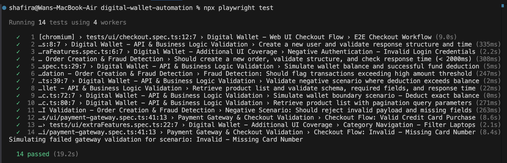
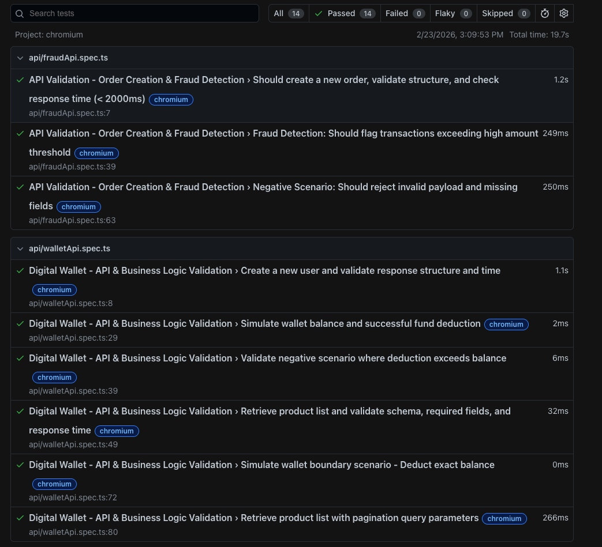
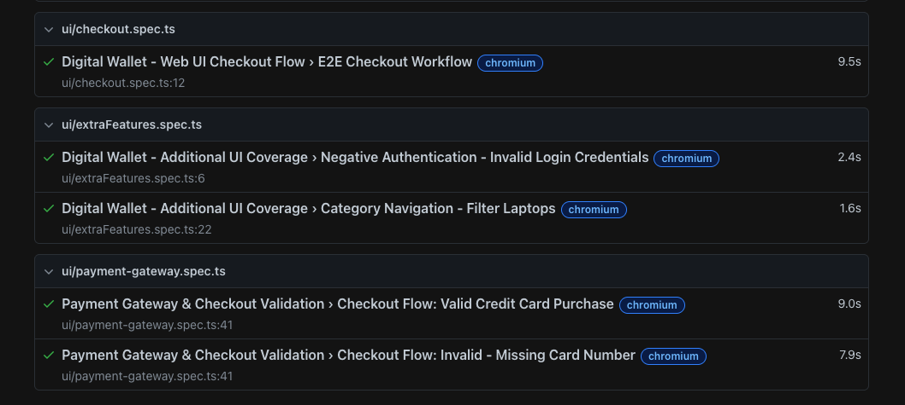

# Digital Wallet & Payment Gateway Automation Framework

This repository contains the advanced automated test suite encompassing both Web UI and API automation within a unified Playwright and TypeScript framework. It is designed to validate End-to-End (E2E) E-commerce workflows, Digital Wallet balances, Payment Gateway logic, and API Fraud Detection.

## Architecture Overview
**Web UI Tests:** Implemented using a strict Page Object Model (POM) architecture to ensure maintainability, stable locators, and zero hardcoded waits
**Data-Driven Testing (DDT):** Externalized JSON test data to loop through multiple valid and invalid payment scenarios efficiently
***API Tests:** Utilizes an organized API service layer with reusable request handling and strict TypeScript typing for schema validation
* **Business Logic:** Incorporates simulated Digital Wallet utilities and Payment Gateway boundary validations (card number, expiry, amount thresholds)

## Key Features Validated
### Web UI (Demoblaze)
**Dynamic E2E Purchasing:** Automates user registration, login, dynamic price extraction, and cart validation
* **Payment Gateway Validation:** Validates credit card limits, missing fields, and amount threshold boundaries.
* **Transaction Integrity:** Verifies order confirmations and ensures no duplicate transactions occur

### API (DummyJSON)
* **Order Creation & Schema Validation:** Validates nested JSON structures and standard HTTP status codes
* **Performance SLAs:** Enforces strict response time assertions (e.g., `< 2000ms`) on critical endpoints
* **Fraud Detection Simulation:** Custom framework-level logic to intercept and flag transactions exceeding monetary thresholds or containing suspicious keywords

##  Prerequisites
* Node.js (v16 or higher)
* npm (Node Package Manager)

## Setup Instructions
1. Clone the repository:
  
   git clone <your-github-repo-url>
   cd digital-wallet-automation

## Setup Instructions
1. Clone the repository:
   
   git clone <your-github-repo-url>
   cd digital-wallet-automation

# Install dependencies and Playwright browsers:
   npm install
   npx playwright install

# Execution Instructions
   Tests can be executed directly from the command line using custom NPM scripts.

# Run the entire suite (UI + API):
   npm run test
   Run targeted test suites:

npm run test:ui          # Runs all Web UI tests
npm run test:api         # Runs all API and Fraud tests
npm run test:ui:payment  # Runs only the Payment Gateway scenarios

# Reporting & Execution Results
The framework automatically generates an HTML report and captures screenshots on failure.

# To view the HTML report after a test run:
npm run report

# Execution Proof
 

# HTML Test Report:

## Known Issues & Bug Reporting (Mock Jira)
During the implementation of Cross-Browser and Mobile Viewport matrix testing, a critical responsive design bug was discovered on the Demoblaze platform. 

**Ticket:** `BUG-1042: Mobile UI Navigation Failure`
* **Environment:** Mobile Chrome (Pixel 5 Emulator), Mobile Safari (iPhone 12 Emulator)
* **Steps to Reproduce:**
  1. Load `https://www.demoblaze.com/` on a mobile viewport (width < 768px).
  2. Attempt to locate the "Cart", "Log in", or "Sign up" buttons.
* **Expected Result:** A responsive "hamburger" menu should appear, allowing mobile users to access core navigation links.
* **Actual Result:** The navigation items are hidden/overflowed off-screen, and no responsive menu is rendered. This completely blocks the E2E checkout and authentication flows for mobile users.
* **Action Taken:** Mobile viewport tests (`Mobile Chrome`, `Mobile Safari`) have been temporarily quarantined/removed from `playwright.config.ts` to ensure the main CI/CD pipeline remains unblocked for the development team while this UI bug is resolved.